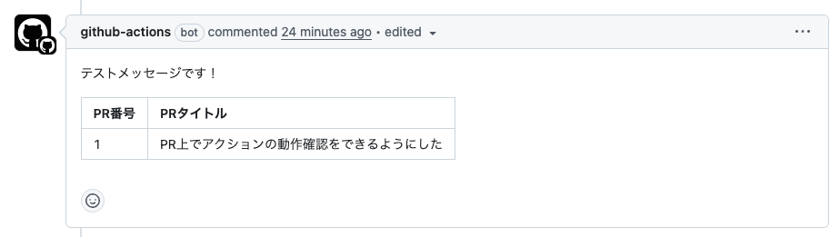

# PR上にコメントするGitHub Action

PR上にコメントするGitHub Action。2回目の場合は元々のコメントに対して編集する。

## 使用例

```yml
# .github/workflows/comment-on-pr
name: PR上にコメントを投稿

on:
  pull_request:

jobs:
  comment-on-pr:
    runs-on: ubuntu-22.04
    permissions:
      pull-requests: write
    steps:
      - uses: actions/checkout@v4

      - name: 投稿するメッセージの用意
        run: |
          echo "テストメッセージです！" >> ./message.md
          echo "|PR番号|PRタイトル|" >> ./message.md
          echo "|:--|:--|" >> ./message.md
          echo "|${{ github.event.pull_request.number }}|${{ github.event.pull_request.title }}|" >> ./message.md

      - name: メッセージの投稿
        uses: TakanoriOnuma/actions-comment-on-pr@dist
        # バージョンを固定したい場合は@の後ろをv0.0.0のようにする
        # uses: TakanoriOnuma/actions-comment-on-pr@v0.0.0
        with:
          message-file-path: ./message.md
          identifier-message: '<!-- TEST COMMENT -->'
```



### 引数

| 名前                 | 説明                                                                     | 必須か |
| -------------------- | ------------------------------------------------------------------------ | ------ |
| `message-file-path`  | コメント内容が記載されたファイルパス。このファイルの中身をコメントする。 | ✅     |
| `identifier-message` | コメント内容の識別子。この識別子があるコメントを編集する。               |        |
| `github-token`       | GitHubトークン。デフォルトでは　`${{ secrets.GITHUB_TOKEN }}` が入る。   |        |
